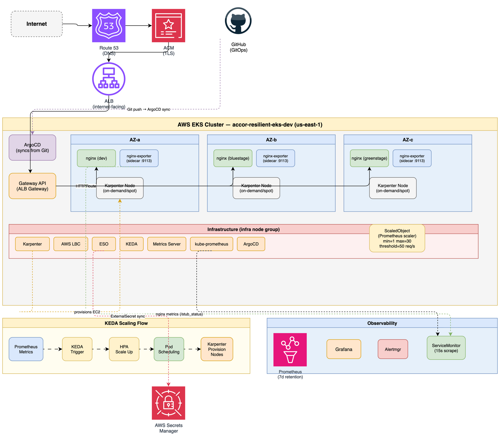

# ACR SRE \- EKS GitOps Infra

This repository manages the EKS cluster *accor-resilient-eks-dev* using a GitOps approach. Our ArgoCD ApplicationSet uses a matrix generator to read JSON configurations and automatically deploy the necessary infrastructure via Helm charts.

## Architecture


## How it works

The *platform-platform-platform-appset.yaml* file acts as the heart of our automation. It uses a matrix generator to coordinate deployments across the environment:

• It identifies configurations from \`infra-configs/common/\*.json\` for global apps or cluster-specific directories for targeted deployments.  
• Every JSON file defines a Helm application, including its repository, chart version, and destination namespace.  
• We use a layered values approach, starting with \`default.yaml\` and applying cluster-specific overrides as needed.

## Managed apps

| App | Chart | Repo | Version | Namespace |
| :---- | :---- | :---- | :---- | :---- |
| karpenter | karpenter | oci://public.ecr.aws/karpenter/karpenter | 1.13.0 | kube-system |
| aws-load-balancer-controller | aws-load-balancer-controller | https://aws.github.io/eks-charts | 3.4.0 | kube-system |
| eso (External Secrets) | external-secrets | https://charts.external-secrets.io | 2.6.0 | external-secrets-system |
| keda | keda | https://kedacore.github.io/charts | 2.16.1 | keda |
| kube-prometheus-stack | kube-prometheus-stack | https://prometheus-community.github.io/helm-charts | 87.10.1 | monitoring |
| metrics-server | metrics-server | https://kubernetes-sigs.github.io/metrics-server/ | 3.13.1 | kube-system |

alb-gateway-config is present but **disabled** (alb-gateway-config.json\_ - trailing underscore keeps it out of the \*.json glob).

## Repo layout

```
platform-platform-appset.yaml                          # ArgoCD ApplicationSet - the entry point
infra-configs/
  common/*.json                      # Apps deployed to every cluster
  accor-resilient-eks-dev/*.json     # Apps scoped to this cluster only
infra-values/
  <app>/default.yaml                 # Base Helm values
  <app>/<clusterName>.yaml           # Cluster override values
demo-app/                           # Scaling/deployment demos (nginx kustomize app, KEDA/Karpenter tests)
docs/
  charts/gateway-config/             # Local Helm chart: Gateway + GatewayClass
  notes/alb-gateway-gatewayclass/    # Reference manifests for ALB Gateway setup
  karpenter-manifests/               # NodePool manifest
scripts/
  getpods.sh                         # List pods on infra-tainted nodes
  argo-install.sh                      # One-shot ArgoCD bootstrap into cluster
```

## Bootstrap

```shell
# 1. Install ArgoCD
bash argo-install.sh

# 2. Apply the ApplicationSet
kubectl apply -f platform-appset.yaml

# 3. Get initial admin password
kubectl -n argocd get secret argocd-initial-admin-secret \
  -o jsonpath='{.data.password}' | base64 -d; echo
```

## Adding an app

1\. Start by creating a new JSON configuration in the appropriate \`infra-configs\` directory.  
2\. Next, define the Helm values by adding a \`default.yaml\` and any necessary cluster overrides.  
3\. Once we commit these changes, ArgoCD automatically recognizes and provisions the new application.

## SLA / SLO / SLI (demo-app)

Reliability targets for the demo-app are defined as code and enforced through the existing kube-prometheus-stack (Prometheus + Grafana + Alertmanager). Full rationale is in [`docs/slo/demo-app-slo.md`](./docs/slo/demo-app-slo.md).

### Indicators (SLIs)

Raw signals come from a synthetic blackbox probe (client → ALB/Gateway → nginx), not nginx metrics - `stub_status` exposes no HTTP status codes or latency, so it cannot produce real error-rate or latency SLIs. Every series carries `slo_service="demo-app"` and a per-environment `namespace` label.

| SLI | Signal | Source |
| :---- | :---- | :---- |
| Availability | `probe_success` (1 = a 2xx was served) | blackbox Probe |
| Latency | `probe_duration_seconds` (p95, end-to-end) | blackbox Probe |

### Objectives (SLO) and contract (SLA)

| Type | Target | Notes |
| :---- | :---- | :---- |
| SLO - Availability | **99.9%** of probes succeed | error budget 0.1% ≈ **43 min / 30 d** |
| SLO - Latency | **p95 `probe_duration` < 200 ms** | measured over 1h |
| SLA - Availability | **99.5%** (external contract) | intentionally looser than the SLO so burn alerts fire first |

> Error rate: a real 5xx/total SLI needs request-level status codes (ALB access-log metrics or a status-aware exporter). Until that exists, availability (`1 - probe_success`) is the proxy - see the note in `slo-rules.yaml`.

### How it is implemented

All resources live in `demo-app/demo-nginx-kustomization/base/` and ship via the demo-app ApplicationSet; overlays patch the probe target to each environment's host (`traffic.maunghtoo.cloud`, `traffic-blue…`, `traffic-green…`).

| Resource | File | Purpose |
| :---- | :---- | :---- |
| `Probe` | `probe.yaml` | blackbox `http_2xx`, 15s interval; produces the raw SLIs |
| `PrometheusRule` | `slo-rules.yaml` | recording rules (availability ratio 5m–3d, p95 latency) + SLO target/error-budget series + multi-window multi-burn-rate alerts |
| Grafana dashboard | `slo-dashboard-configmap.yaml` | demo-app SLO/SLI overview |
| Grafana dashboard | `slo-dashboard-bluegreen-configmap.yaml` | blue/green comparison, split by `namespace` |

Alerting follows the Google-SRE multi-window multi-burn-rate pattern on the availability budget:

| Alert | Burn rate | Windows | Severity |
| :---- | :---- | :---- | :---- |
| DemoAppAvailabilityErrorBudgetBurnFast | 14.4× | 1h + 5m | critical |
| DemoAppAvailabilityErrorBudgetBurnMedium | 6× | 6h + 30m | critical |
| DemoAppAvailabilityErrorBudgetBurnSlow | 3× | 1d + 2h | warning |
| DemoAppLatencySLOBreach | p95 > 200 ms for 1h | 1h | warning |

Prometheus scrapes the Probe (via the `release: kube-prometheus-stack` label) and evaluates the rules; the Grafana sidecar auto-discovers the dashboards (`grafana_dashboard` label, `searchNamespace: ALL`). The only operational prerequisite is Prometheus retention ≥ 30 d to back the 30-day SLO window.

## Key details

• Our Karpenter setup is designed to run specifically on nodes marked with the \`infra\` purpose for better resource isolation.  
• The AWS Load Balancer Controller is configured with the ALB Gateway API enabled, utilizing a dedicated GatewayClass for traffic management.  
• We use External Secrets Operator to securely connect to AWS Secrets Manager using Pod Identity for a credential-less security model.  
• For consistency, all applications use automated synchronization with pruning and self-healing enabled.
